# Group8 DevOps Coursework

This repository is developed and maintained by **Group 8 of Edinburgh Napier University** as part of the **DevOps coursework project**.
It serves as a collaborative platform where all team members contribute to the **design, implementation, and delivery** of the project.

---

## Contribution SpreadSheet
| Matriculation Number | Code Review 1 | Code Review 2 |
|----------------------|---------------|---------------|
| 40794417             | 20            | -             |
| 40794419             | 20            | -             |
| 40794538             | 20            | -             |
| 40794505             | 20            | -             |
| 40794416             | 20            | -             |
| **Total**            | **100**       | **-**         |

---
## Status Badges


[](https://github.com/40794417KaungKhantPaing/DevOpsCourseworkGroup8/blob/master/LICENSE)

[](https://github.com/40794417KaungKhantPaing/DevOpsCourseworkGroup8/releases)
[](https://codecov.io/gh/40794417KaungKhantPaing/DevOpsCourseworkGroup8)

---
## Overview

The project is a **Population Reporting System** that generates reports on global, continental, and regional populations using the `world.sql` dataset.
It demonstrates **DevOps principles** such as CI/CD, automated builds, containerization, and collaborative development.

---

## Purpose

The purpose of this system is to:

* Provide population insights across different geographic levels.
* Showcase integration of databases, automation tools, and DevOps pipelines.
* Enable continuous improvement and teamwork in software delivery.

---

## Requirements

Before running the project, make sure the following are installed and configured:

**JDK 24** – Ensure JDK 24 is installed and set as default
**Maven 3.9+** – For build automation and dependency management
**MySQL Database** – Import the `world.sql` dataset before running the application
**Git / GitHub** – For version control and collaboration

---

## Build and Run
To build and run the project locally, follow these steps:

1. **Clean the project**:

    ```bash
    mvn clean
    ```

2. **Validate the project**:

   ```bash
   mvn validate
   ```

3. **Compile the project**:

   ```bash
   mvn compile
   ```

4. **Package the project**:

   ```bash
   mvn package
   ```

5. **Run the project using Docker Compose**:
   Ensure you have a `docker-compose.yml` file in your project directory, then run:

   ```bash
   docker-compose up --build
   ```

This will build the Docker image and start the application as defined in the `docker-compose.yml` file.

---

## Kanban Board

You can follow our tasks and progress here:
[Group 8 Backlog / Kanban Board](https://zube.io/napier-450/devopscourseworkgroup8/w/workspace-1/kanban)

---

## Documents

You can also view the following key documents:

- [Code of Conduct](CODE_OF_CONDUCT.md)
- [Product Backlog](PRODUCT_BACKLOG.md)
- [Use Cases](USE_CASES.md)
- [Contribution Guidelines](CONTRIBUTING.md)
- [Security Policy](SECURITY.md)
---

## Contribution Guidelines

We welcome contributions from team members.
Please ensure:

* Code follows best practices and is properly documented.
* Branch naming follows the `feature/`, `bugfix/`, or `hotfix/` convention.
* Pull requests are reviewed before merging.

(Refer to the [Code of Conduct](CODE_OF_CONDUCT.md), [Contribution Guidelines](CONTRIBUTING.md))

---

## Team Members

- **40794417 – Kaung Khant Paing** – **Product Owner**
- **40794419 – Thant Lwin Maung** – **Scrum Master**
- **40794538 – Khin Chaw Shwe Yee**
- **40794505 – Mon Htoo Aung**
- **40794416 – Cham Myae Zin**

---


##  All reports requirements have been implemented, which is 100% of the total requirements.
| ID | Name                                                                                                                                     | Met  | Screenshot                           |
| -: | ---------------------------------------------------------------------------------------------------------------------------------------- |------|--------------------------------------|
|  1 | All the countries in the world organised by largest population to smallest.                                                              | Met  |   |
|  2 | All the countries in a continent organised by largest population to smallest.                                                            | Met  | 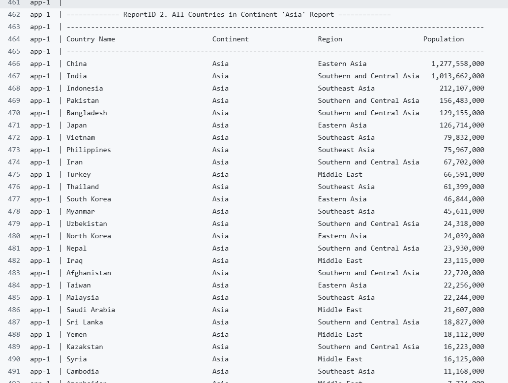  |
|  3 | All the countries in a region organised by largest population to smallest.                                                               | Met  |   |
|  4 | The top N populated countries in the world where N is provided by the user.                                                              | Met  | 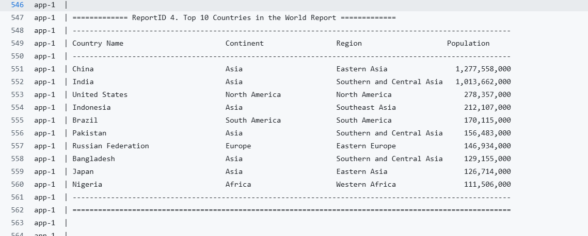  |
|  5 | The top N populated countries in a continent where N is provided by the user.                                                            | Met  | 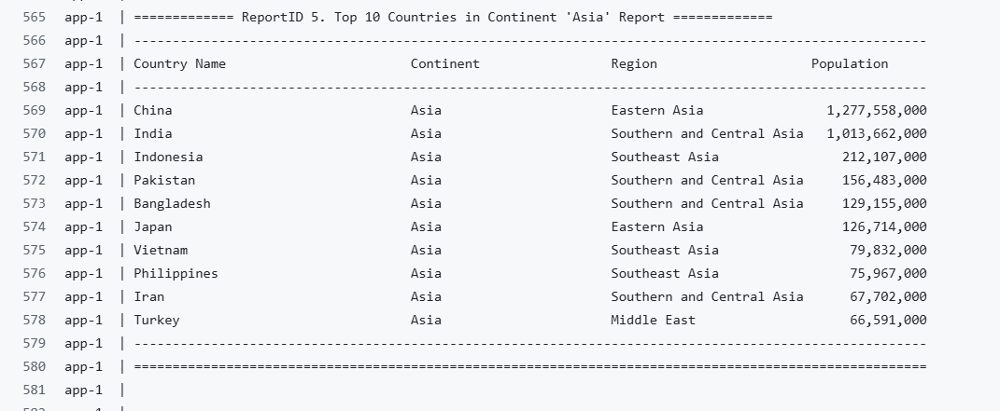  |
|  6 | The top N populated countries in a region where N is provided by the user.                                                               | Met  |   |
|  7 | All the cities in the world organised by largest population to smallest.                                                                 | Met  | 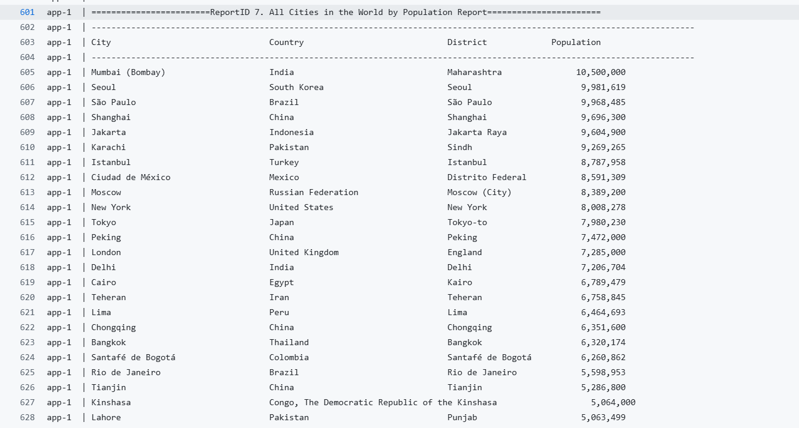  |
|  8 | All the cities in a continent organised by largest population to smallest.                                                               | Met  | 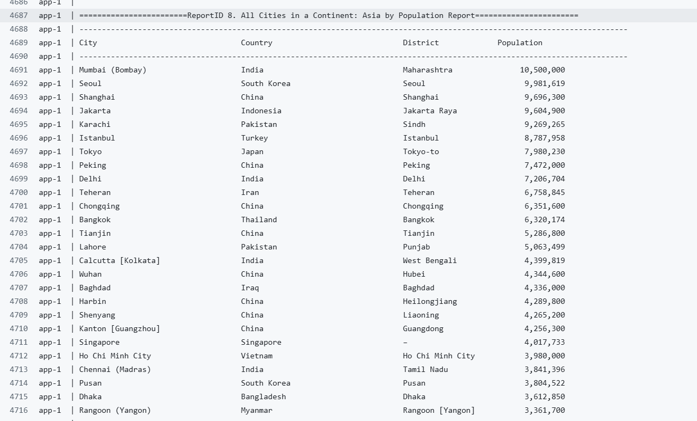  |
|  9 | All the cities in a region organised by largest population to smallest.                                                                  | Met  |   |
| 10 | All the cities in a country organised by largest population to smallest.                                                                 | Met  | 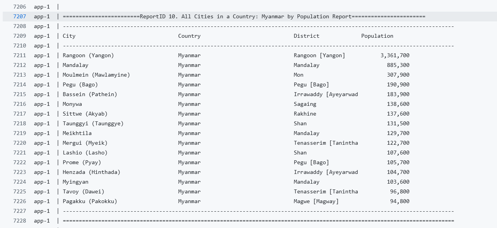 |
| 11 | All the cities in a district organised by largest population to smallest.                                                                | Met  |  |
| 12 | The top N populated cities in the world where N is provided by the user.                                                                 | Met  | 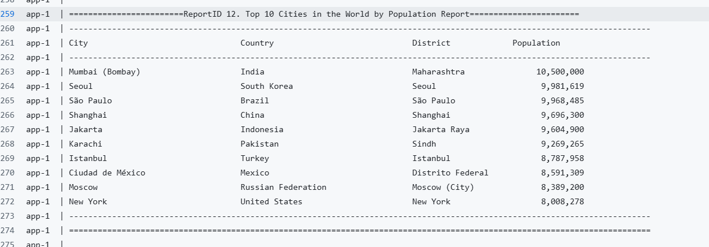 |
| 13 | The top N populated cities in a continent where N is provided by the user.                                                               | Met  | 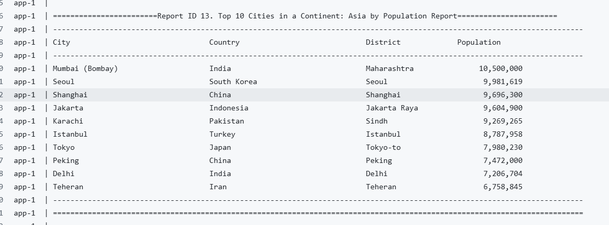 |
| 14 | The top N populated cities in a region where N is provided by the user.                                                                  | Met  |  |
| 15 | The top N populated cities in a country where N is provided by the user.                                                                 | Met  |  |
| 16 | The top N populated cities in a district where N is provided by the user.                                                                | Met  |  |
| 17 | All the capital cities in the world organised by largest population to smallest.                                                         | Met  | 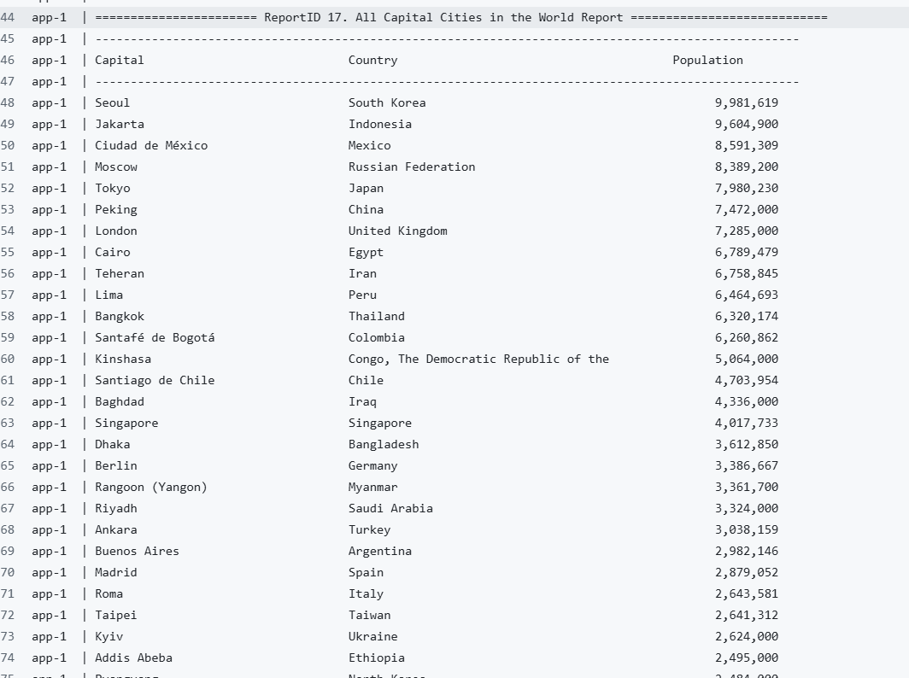 |
| 18 | All the capital cities in a continent organised by largest population to smallest.                                                       | Met  |  |
| 19 | All the capital cities in a region organised by largest to smallest.                                                                     | Met  |  |
| 20 | The top N populated capital cities in the world where N is provided by the user.                                                         | Met  |  |
| 21 | The top N populated capital cities in a continent where N is provided by the user.                                                       | Met  | 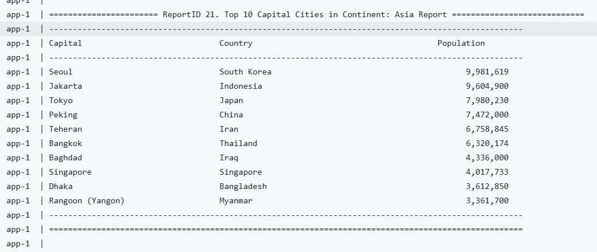 |
| 22 | The top N populated capital cities in a region where N is provided by the user.                                                          | Met  |  |
| 23 | The population of people, people living in cities, and people not living in cities in each continent.                                    | Met  |  |
| 24 | The population of people, people living in cities, and people not living in cities in each region.                                       | Met  |  |
| 25 | The population of people, people living in cities, and people not living in cities in each country.                                      | Met  |  |
| 26 | The population of the world.                                                                                                             | Met  | 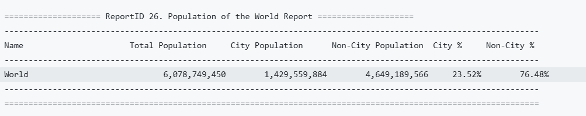 |
| 27 | The population of a continent.                                                                                                           | Met  |  |
| 28 | The population of a region.                                                                                                              | Met  |  |
| 29 | The population of a country.                                                                                                             | Met  |  |
| 30 | The population of a district.                                                                                                            | Met  |  |
| 31 | The population of a city.                                                                                                                | Met  |  |
| 32 | Number of people who speak (from greatest to smallest) and percentage of world population for: Chinese, English, Hindi, Spanish, Arabic. | Met  |  |
