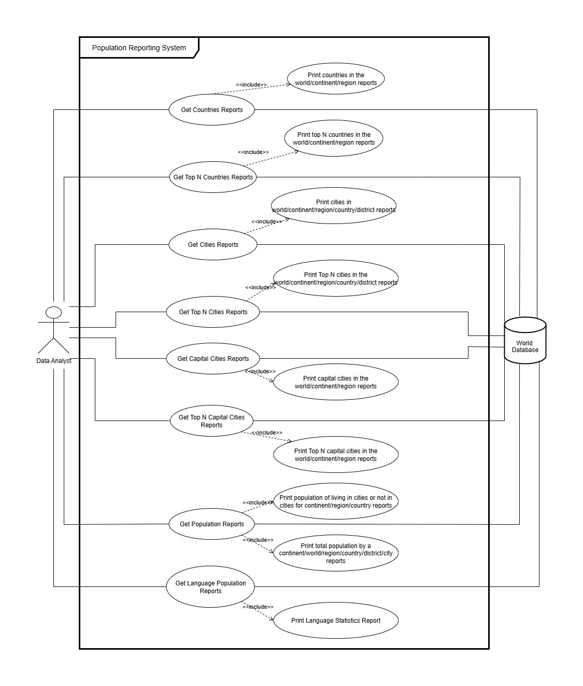

# Use Cases

This document outlines the key **use cases** of the **Population Reporting System**. Each use case describes a specific
user action, including the required conditions for that action to be executed, the flow of events, and the expected results.

---
# Population Reporting System – Use Case Documentation

## User Description
The user, a Data Analyst interacts with the Population Reporting System to view population, country, city, and language 
information. The User can view data for all countries, top N countries or cities, capital cities, and language 
statistics. The system generates reports at different levels (world, continent, region, country, district, or city).

# Population Reporting System Use Cases

---

## 1. View All Countries by Population

**Goal in Context:**  
As a data analyst, I want to view all countries in a specified area (world, continent, or region) ordered by population from largest to smallest so that I can understand population distribution globally, continentally, and regionally.

**Scope:** Population Reporting System  
**Level:** Primary task  
**Preconditions:** Database contains population data for all countries.  
**Success End Condition:** A report of countries ranked by population is available.  
**Failed End Condition:** No report is produced if country data is missing.  
**Primary Actor:** Data Analyst  
**Trigger:** A request for country population report is sent by the analyst.

### Main Success Scenario
1. Analyst requests countries reports.
2. System automatically retrieves population data for countries at all predefined levels (world, continent, region).
3. System prints the report of countries ordered by population.
4. Analyst gets countries reports.

### Extensions
- If country data is missing: System prints an error message indicating data is not available.

### Sub-Variations
- Level selection is predefined by the system.

**Schedule:** Due Date: Release 1.0

---

## 2. View Top N Countries by Population

**Goal in Context:**  
As a data analyst, I want to view the top N most populated countries in a specified area (world, continent, or region) so that I can quickly identify key countries by population.

**Scope:** Population Reporting System  
**Level:** Primary task  
**Preconditions:** Database contains population data for all countries.  
**Success End Condition:** A report of Top N countries by population is available.  
**Failed End Condition:** No report is produced if data is missing or N is invalid.  
**Primary Actor:** Data Analyst  
**Trigger:** A request for Top N country population report is sent by the analyst.

### Main Success Scenario
1. Analyst requests Top N countries reports.
2. System automatically retrieves population data for countries at predefined levels.
3. System prints the Top N countries report.
4. Analyst gets Top N countries reports.

### Extensions
- If N exceeds available countries: System prints all available countries.
- If country data is missing: System prints an error message.

### Sub-Variations
- Level selection and N are predefined by the system.

**Schedule:** Due Date: Release 2.0

---

## 3. View All Cities by Population

**Goal in Context:**  
As a data analyst, I want to view all cities in a specified area (world, continent, region, country, or district) ordered by population from largest to smallest so that I can understand urban population distribution at different levels.

**Scope:** Population Reporting System  
**Level:** Primary task  
**Preconditions:** Database contains population data for all cities.  
**Success End Condition:** A report of cities ranked by population is available.  
**Failed End Condition:** No report is produced if city data is missing.  
**Primary Actor:** Data Analyst  
**Trigger:** A request for city population report is sent by the analyst.

### Main Success Scenario
1. Analyst requests cities reports.
2. System automatically retrieves population data for cities at predefined levels.
3. System prints the cities report ordered by population.
4. Analyst gets cities reports.

### Extensions
- If city data is missing: System prints an error message.

### Sub-Variations
- Level selection is predefined by the system.

**Schedule:** Due Date: Release 1.0

---

## 4. View Top N Cities by Population

**Goal in Context:**  
As a data analyst, I want to view the top N most populated cities in a specified area (world, continent, region, country, or district) so that I can quickly identify major urban centers.

**Scope:** Population Reporting System  
**Level:** Primary task  
**Preconditions:** Database contains population data for all cities.  
**Success End Condition:** A report of Top N cities is available.  
**Failed End Condition:** No report is produced if data is missing or N is invalid.  
**Primary Actor:** Data Analyst  
**Trigger:** A request for Top N city report is sent by the analyst.

### Main Success Scenario
1. Analyst requests Top N cities reports.
2. System automatically retrieves population data for cities at predefined levels.
3. System prints the Top N cities report.
4. Analyst gets Top N cities reports.

### Extensions
- If N exceeds available cities: System prints all available cities.
- If city data is missing: System prints an error message.

### Sub-Variations
- Level selection and N are predefined by the system.

**Schedule:** Due Date: Release 2.0

---

## 5. View All Capital Cities by Population

**Goal in Context:**  
As a data analyst, I want to view all capital cities in a specified area (world, continent, or region) ordered by population from largest to smallest so that I can compare capitals globally, continentally, or regionally.

**Scope:** Population Reporting System  
**Level:** Primary task  
**Preconditions:** Database contains population data for all capital cities.  
**Success End Condition:** A report of capital cities ranked by population is available.  
**Failed End Condition:** No report is produced if data is missing.  
**Primary Actor:** Data Analyst  
**Trigger:** A request for capital cities report is sent by the analyst.

### Main Success Scenario
1. Analyst requests capital cities reports.
2. System automatically retrieves population data for capital cities at predefined levels.
3. System prints the capital cities report ordered by population.
4. Analyst gets capital cities reports.

### Extensions
- If capital city data is missing: System prints an error message.

### Sub-Variations
- Level selection is predefined by the system.

**Schedule:** Due Date: Release 1.0

---

## 6. View Top N Capital Cities by Population

**Goal in Context:**  
As a data analyst, I want to view the top N most populated capital cities in a specified area (world, continent, or region) so that I can quickly identify major capitals.

**Scope:** Population Reporting System  
**Level:** Primary task  
**Preconditions:** Database contains population data for all capital cities.  
**Success End Condition:** A report of Top N capital cities is available.  
**Failed End Condition:** No report is produced if data is missing or N is invalid.  
**Primary Actor:** Data Analyst  
**Trigger:** A request for Top N capital cities report is sent by the analyst.

### Main Success Scenario
1. Analyst requests Top N capital cities reports.
2. System automatically retrieves population data for capital cities at predefined levels.
3. System prints the Top N capital cities report.
4. Analyst gets Top N capital cities reports.

### Extensions
- If N exceeds available capitals: System prints all available capitals.
- If capital city data is missing: System prints an error message.

### Sub-Variations
- Level selection and N are predefined by the system.

**Schedule:** Due Date: Release 2.0

---

## 7. View Language Statistics

**Goal in Context:**  
As a data analyst, I want to view a report showing the number of people who speak Chinese, English, Hindi, Spanish, and Arabic, sorted from greatest to smallest, including world population percentage so that I can understand major languages.

**Scope:** Population Reporting System  
**Level:** Primary task  
**Preconditions:** Database contains language statistics and population data.  
**Success End Condition:** A report of the selected languages with population counts and percentages is available.  
**Failed End Condition:** No report is produced if language data is missing.  
**Primary Actor:** Data Analyst  
**Trigger:** A request for language statistics report is sent by the analyst.

### Main Success Scenario
1. Analyst requests language statistics reports.
2. System automatically retrieves language population data.
3. System prints the language statistics report.
4. Analyst gets language statistics reports.

### Extensions
- If language data is missing: System prints an error message.

**Sub-Variations:** None

**Schedule:** Due Date: Release 1.0

---

## 8. View Population Data (Living in Cities / Total)

**Goal in Context:**  
As a data analyst, I want to view the total population, population living in cities, and population not living in cities for a specified area (continent, region, or country) so that I can understand urban vs rural distribution, and also I want to view the total population for a specified area (world, continent, region, country, district, or city) so that I can understand population totals at different levels.

**Scope:** Population Reporting System  
**Level:** Primary task  
**Preconditions:** Database contains population data for all levels.  
**Success End Condition:** Reports for urban/rural and total population are available.  
**Failed End Condition:** No report is produced if data is missing.  
**Primary Actor:** Data Analyst  
**Trigger:** A request for population reports is sent by the analyst.

### Main Success Scenario
1. Analyst requests population reports.
2. System retrieves population data for all predefined levels.
3. System prints population living in cities or not and total population report.
4. Analyst gets population reports.

### Extensions
- If population data is missing: System prints an error message.

### Sub-Variations
- Level selection is predefined by the system.

**Schedule:** Due Date: Release 2.0
---

## Notes
- All `Get Reports` use cases fetch data from the database.
- `Print` use cases are automatically called after fetching data.
- All actions follow a main flow from request to report generation.

---

### **Link to Use Case Diagram**
You can also refer to the detailed **Use Case Diagram** for visual clarity:

[Use Case Diagram](./use_case_diagram.drawio)

---

This **USE_CASES.md** document outlines all the core user actions within the **Population Reporting System**. 
Each use case provides a detailed overview of what happens during the process, including pre-conditions, main flow, 
and post-conditions.
